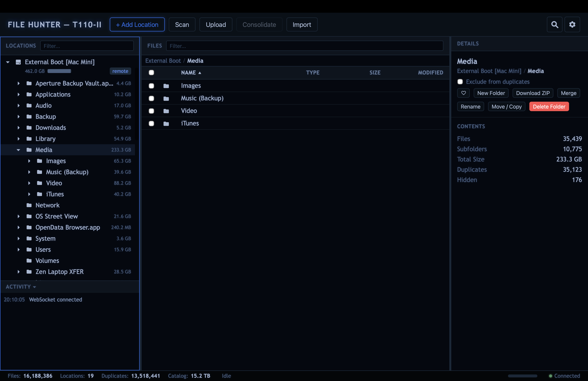

# File Hunter

A self-hosted, web-based file manager that remembers everything — even drives you disconnect.

Catalog files across USB drives, backup disks, DVDs, network mounts, and local folders. Browse and search them when the media is offline. Find duplicates across terabytes of archives, consolidate them with a full audit trail, and manage it all from any browser — including on headless servers with no desktop at all.

Tested on production catalogs with over ten million files. The UI stays responsive during scans.



This application was developed with the assistance of AI tools (Claude Opus, Kimi K2.5 and Qwen3-Coder-Next). These tools were used for code linting, syntax checking, testing, performance optimisation (particularly the SQLite queries), the theme engine and code refactoring. All generated code is manually reviewed and heavily tested in real use.

## Features

- **Offline catalog** — scan any folder and the full file tree persists in a local SQLite database. Unplug the drive, unmount the share — keep browsing, searching, and planning as if it were still there.
- **Duplicate detection** — three-gate hashing (size pre-filter, xxHash64 partial, SHA-256 full) identifies byte-identical files across all locations with minimal I/O.
- **Consolidation** — keep one copy, stub the rest. Two modes: keep in place or copy to a chosen destination. Hash-verified copies, `.moved` stubs, and `.sources` metadata for full provenance.
- **Merge folders** — merge entire locations or folder trees. Unique files are copied preserving structure, duplicates are stubbed at the source. Background task with cancel support.
- **Storage treemap** — interactive squarified treemap per location. Drill into folders, see individual large files, click to navigate. Theme-aware colour palette.
- **Full file management** — move, rename, delete files and folders. Create new folders. Upload via drag-and-drop (duplicates detected on arrival). Download files or entire folders as ZIP.
- **Batch operations** — multi-select with checkboxes, Shift+click, Ctrl+click. Bulk delete, move, tag, or download as ZIP.
- **Powerful search** — filter by filename (with match modes: anywhere, starts with, ends with, exact), file type, tags, description, size range, and date range. Search files, folders, or both. Filter to duplicates only. Results span all locations, online and offline. "Show in Folder" jumps to any result.
- **Inline previews** — images, video, audio, PDFs, and text files render inline in the detail panel.
- **Scheduled scans** — per-location schedules: pick days of the week and a time. Scans enqueue automatically. Offline locations are silently skipped.
- **Background scanning** — scans run as server-side tasks. Close the browser, come back later. Incremental rescans skip unchanged files.
- **Multi-user auth** — token-based authentication with PBKDF2 password hashing. First-run setup wizard. All users share full access.
- **Tags & descriptions** — add metadata to any file. Searchable and persistent, even when drives are offline.
- **17 themes** — switch at runtime: Cyber, C64, Neon, Solaris, Amber Monitor, Green Monitor, Blue, Aqua, Light Blue, Corporate, Default Light, and more. Every theme includes custom treemap colours.
- **Keyboard navigation** — full keyboard support across all panels. Arrow keys, Tab cycling, Enter to activate, shortcuts for search and filters.
- **Scan queue** — queue up multiple location scans and they run one after another. Close the browser, come back — the queue kept going.
- **Stale file detection** — rescans detect files that have disappeared and mark them stale. Your catalog stays honest about what's actually on disk.
- **Real-time updates** — WebSocket connection streams scan progress, upload status, and mutations to every connected browser.

## Who is it for

- **Home lab operators** — manage files on a headless server from any browser. No desktop environment needed.
- **Photographers & videographers** — catalog shoots across dozens of external drives. Find that one file even when the drive is in a drawer.
- **Data hoarders** — see what you have, where it is, and how much of it is duplicated. Reclaim terabytes.
- **Sysadmins** — audit storage usage across backup drives and archive media. Schedule scans, review from anywhere.

## Requirements

- Python 3.10+

## Installation

```bash
curl -fsSL https://filehunter.zenlogic.uk/install | bash
```

Downloads the latest release, extracts it, and you're ready to go. Works on macOS, Linux, and WSL.

Or download the latest release manually from the [releases page](https://github.com/zen-logic/file-hunter/releases/latest), extract it wherever you like, and run `./filehunter`.

## Usage

```bash
cd filehunter-x.x.x
./filehunter
```

On first run, the launcher prompts for host and port, creates a virtual environment, and installs dependencies. Then open the URL shown in your browser.

### Getting started

1. On first launch, create your user account in the setup screen
2. Click **+ Add Location** and browse to a folder (a USB drive, a subfolder on a disk, a network mount, etc.)
3. A scan starts automatically — file metadata and hashes are computed and stored in the catalog
4. Browse the location tree, search files, review duplicates, and consolidate when ready

Everything is self-contained in the install directory — database, config, and virtual environment. Move the folder and it still works. Delete it and it's completely gone.

## Tech stack

- **Backend** — Python, Starlette, uvicorn, aiosqlite
- **Frontend** — vanilla HTML/CSS/JavaScript (no frameworks, no build step)
- **Database** — SQLite in WAL mode
- **Hashing** — xxHash64 + SHA-256

No cloud services. No telemetry. No framework dependencies. Your files never leave your machine.

## File Hunter Pro

File Hunter is free, open source, and always will be. File Hunter Pro is an optional extension that adds remote agent support — install a lightweight agent on any machine on your network and its drives appear as locations in your catalog. Browse, search, scan, preview, and stream content from remote machines as if the files were local. Duplicates are detected across all machines using the same three-gate hashing strategy.

See the [landing page](https://zen-logic.github.io/file-hunter/) for details.

## Links

- [Landing page](https://zen-logic.github.io/file-hunter/)

## License

Copyright 2026 [Zen Logic Ltd.](https://zenlogic.co.uk)
