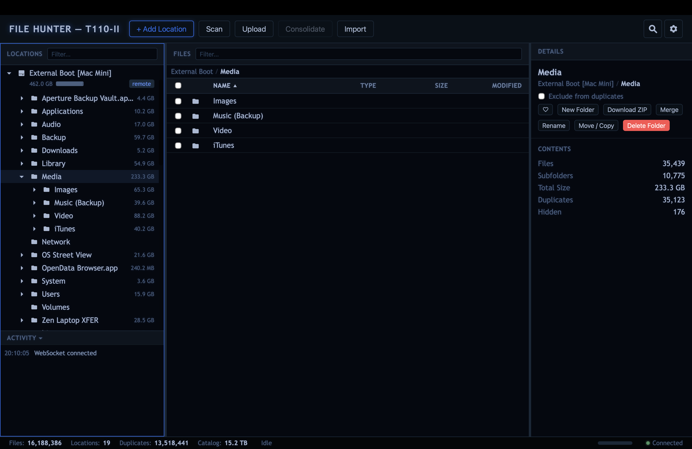

# File Hunter

A self-hosted, web-based file manager that remembers everything - even drives you disconnect.

Catalogue files across USB drives, backup disks, DVDs, network mounts, and local folders. Browse and search them when the media is offline. Find duplicates across terabytes of archives, consolidate them with a full audit trail, and manage it all from any browser - including on headless servers with no desktop at all.

Built for real-world scale. The UI stays responsive during scans.



## Features

See [FEATURES.md](docs/FEATURES.md) for the full feature list.

## Requirements

- Python 3.10+

## Installation

```bash
curl -fsSL https://filehunter.zenlogic.uk/install | bash
```

Downloads the latest release, extracts it, and you're ready to go. Works on macOS, Linux, and WSL.

Or download the latest release manually from the [releases page](https://github.com/zen-logic/file-hunter/releases/latest), extract it wherever you like, and run `./filehunter`.

### Install via Docker

The following project tracks this repo's releases and updates the images accordingly.  Instructions are in the project repo for setup:

https://github.com/ikidd/file-hunter-dockerized

### Install from source

```bash
git clone https://github.com/zen-logic/file-hunter.git
git clone https://github.com/zen-logic/file-hunter-agent.git
cd file-hunter
./filehunter
```

## Usage

```bash
cd filehunter-x.x.x
./filehunter
```

On first run, the launcher prompts for host and port, creates a virtual environment, and installs dependencies. Then open the URL shown in your browser.

### Getting started

1. On first launch, create your user account in the setup screen
2. Click **+ Add Location** and browse to a folder (a USB drive, a subfolder on a disk, a network mount, etc.)
3. Select the location and click **Scan** - file metadata and hashes are computed and stored in the catalogue
4. Browse the location tree, search files, review duplicates, and consolidate when ready

Everything is self-contained in the install directory - database, config, and virtual environment. Move the folder and it still works. Delete it and it's completely gone.

## AI Disclosure

This application was developed with the assistance of AI tools (Claude Opus, Kimi K2.5 and Qwen3-Coder-Next). These tools were used for code linting, syntax checking, testing, performance optimisation (particularly the SQLite WAL optimisation and DB locking operations), the theme engine and code refactoring. All generated code is manually reviewed and heavily tested in real use.

## Links

- [Website](https://filehunter.zenlogic.uk)

## License

Copyright 2026 [Zen Logic Ltd.](https://zenlogic.co.uk)
